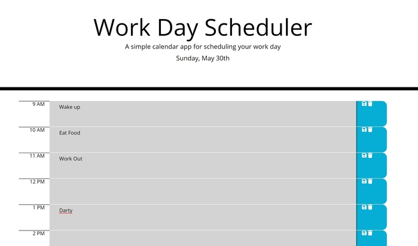

# Daily Schedule Planner

## Description
This daily planner has been designed to assist busy professionals schedule events throughout their workday. 
It functions through storage of their events, meant to last until they're manually deleted while also color coded
to reflect past, present and future events. The planner refreshes every hour to remain up-to-date. 

### Issues Resolved
* Current day displayed at top of calendar
* Time blocks functionally reflect standard business hours
* Color Blocks time-coded for past, present and future use
* Clicking time block allows user to enter event and save to local storage
* Saved events persist when page is refreshed

### Issues Remaining
* While planner generally resembles mockup, small details such as size of save and delete icons, are slightly off

## Link to Daily Planner

[Click here to schedule your day!](https://jk1956.github.io/Daily-Planner/)

## Screenshots of deployed page
S
The workday planner will appear as the following once deployed in a traditonal desktop browser after business hours:

## Sources

* [moment.js](https://momentjs.com/)
* [jquery](https://jquery.com/)
* [Reference for how to format appended columns](https://getbootstrap.com/docs/5.0/layout/columns/)
* [How to color code timeblocks](https://stackoverflow.com/questions/59995703/trying-to-change-background-color-based-off-if-the-hour-is-in-the-past-current)
* [Set Interval](https://www.w3schools.com/jsref/met_win_setinterval.asp)
* [Save and delete items to and from local storage](https://blog.logrocket.com/localstorage-javascript-complete-guide/#setitem)

## Credits

Project idea and supplementary code provided in module 5 of UCF Bootcamp. Code used from Bootstrap, JQuery and W3 Schools.